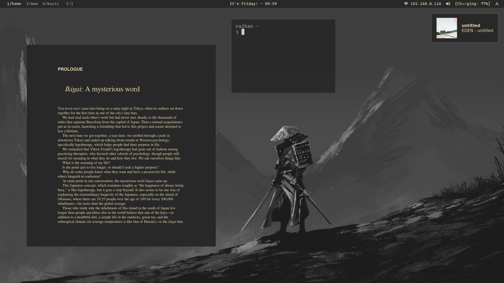

<div align="center">

<!-- BADGES -->
   <p></p>
   <a href="https://github.com/raihanadf/dotfiles/stargazers">
      
   </a>
   <a href="https://github.com/raihanadf/dotfiles/">
      
  </a>
</div>

<p></p>



<div align="center">

<h3><b>Welcome!</b></h3> 
This repo is a collection of my dotfiles. I mainly develop/study for Android <i>(Kotlin, any)</i>, and Web with <i>(Javascript, PHP, any)</i>. These may impact how my editors are configured.

</div>

<br/>
<br/>

## Initial Setup

```shell script

# setup the ssh key for git
email="<your email>"
ssh-keygen -t ed25519 -C "${email}"

# clone and make a new directory (for me)
git clone git@github.com:raihanadf/dotfiles.git ~/.dotfiles

# install (you better not do this)
cd ~/.dotfiles
./install

```

<br/>

## Details

some information about my setup:

- OS: [Arch Linux](https://archlinux.org/)
- Terminal: [kitty](https://github.com/kovidgoyal/kitty)
- Shell: [zsh](https://www.zsh.org/)
- WM: [dwm](https://github.com/raihanadf/dwm)
- Login Manager: [sddm](https://wiki.archlinux.org/title/SDDM)
- Editor: [nvim](https://github.com/neovim/neovim)

## Issues on my main machine

- June 20ish 2023
  - dwm cool_autostart patch *SIGTERM signal doesn't kill all running bash scripts for some reason
    - maybe systemd causes it
  - possible solution:
    - downgrade all packages to specific date (05/06/2023 or 20/06/2023)
    - ^might break the setup


<br/>
